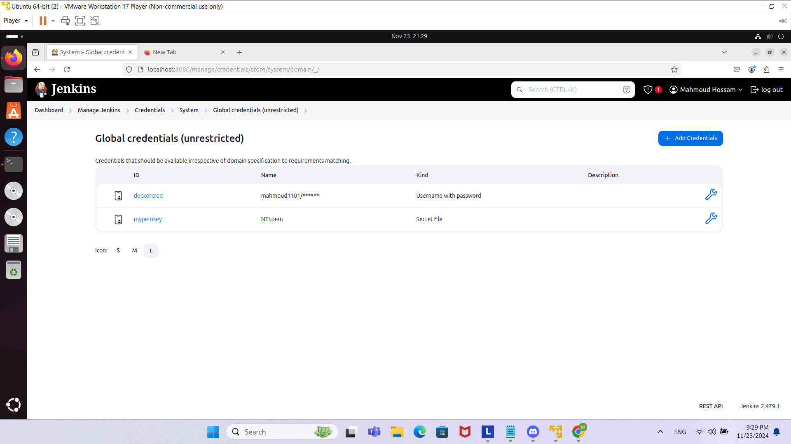
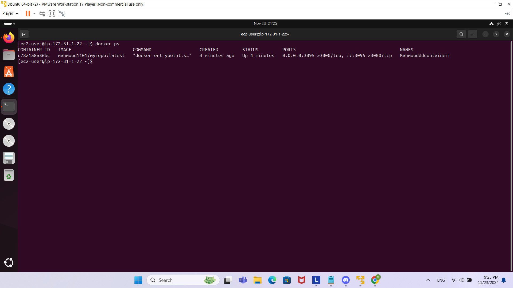

First of all I created the app.js file, where it outputs a Hello world.
Then I created the package.json for its dependencies
Then I created the Dockerfile which will be used for building this image, also exposing port 3000.
Then I went on and installed the jenkins server on my ubuntu virtual machine.
In my jenkins pipeline I created 2 environment varialbes which were the EC2_HOST and the PEM_FILE.
For the PEM_FILE, I first added the .pem file to jenkins as a secret file, by going into my jenkins dashboard >>> Manage Jenkins >>> Credentials >>> clicking on system >>> clicking on "Add credentials" then choosing the kind a secret file for my .pem I also created a Username and password for my docker hub credentials to be stored to use it later.
Here is an image for the mypemkey and my docker credentials I created that had the file NTI.pem which I used in the code:

Then I created a stage called GETGITREPO and Build Docker Image for building the Dockerfile in that repo and then a stage called Push to Docker Hub to push the created image into my repo using the credentials I configured for my docker hub with the username and password as in the image.
I then ssh into the instance and <<EOF was not working with me so instead I added "" after I ssh and also another "" at the end of my commands, as if I did not do that, these commands were being written outside of the ec2 instance after I got inside it which I did not want.
I then pulled the image and ran it.
Here is an image for the docker container which was created inside the EC2 instance from my jenkins pipeline:

And here are some screenshots for the output of my jenkins pipeline:

